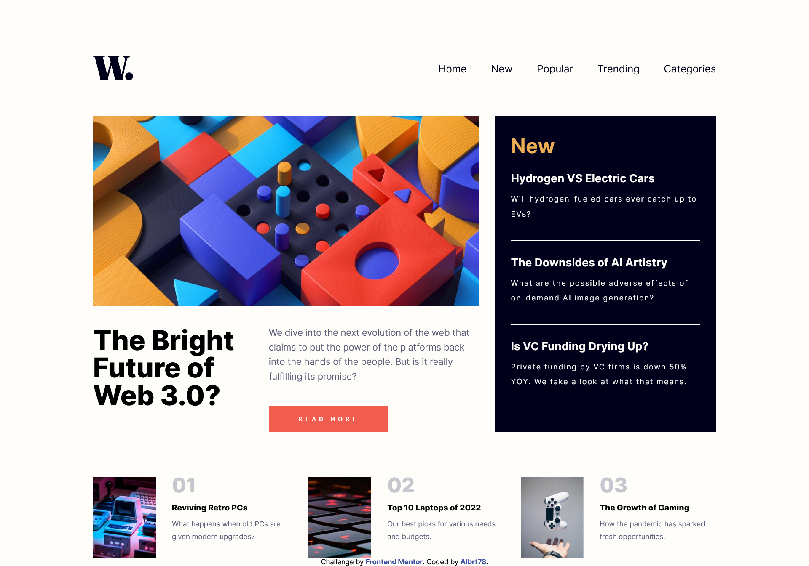

# Frontend Mentor - News homepage

## Welcome! 👋

Thanks for checking out this front-end coding challenge.

[Frontend Mentor](https://www.frontendmentor.io) challenges help you improve your coding skills by building realistic projects.

# Frontend Mentor - News homepage solution

This is a solution to the [News homepage challenge on Frontend Mentor](https://www.frontendmentor.io/challenges/news-homepage-H6SWTa1MFl). Frontend Mentor challenges help you improve your coding skills by building realistic projects.

## Table of contents

-   [Overview](#overview)
-   [The challenge](#the-challenge)
-   [Screenshot](#screenshot)
-   [Links](#links)
-   [Built with](#built-with)
-   [Author](#author)

## Overview

This challenge is designed based on the provided template from Frontend Mentor which help us improve our coding skills by building realistic projects.

### The challenge

Users should be able to:

-   View the optimal layout for the interface depending on their device's screen size
-   See hover and focus states for all interactive elements on the page

### Screenshot

### Links

-   Solution URL: [News Homepage](https://github.com/Albrt78/statspreviewcardcomponent.github.io/tree/main)
-   Live Site URL: [News Homepage](https://albrt78.github.io/statspreviewcardcomponent.github.io/)

### Built with

-   Semantic HTML5 markup
-   CSS custom properties
-   Flexbox
-   [SASS](https://sass-lang.com/guide/) - CSS Preprocessor

## Author

-   Frontend Mentor - [@Albrt78](https://www.frontendmentor.io/profile/Albrt78)
